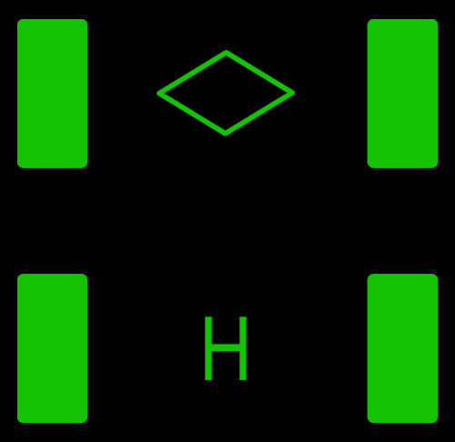

# F-4E RWR PRF Sound Player (F-4E-RWR-PRF-Library)

A web-based library for listening to and studying Radar Warning Receiver (RWR) Pulse Repetition Frequency (PRF) tones used in the **DCS Heatblur F-4E Phantom module**, especially useful for Handoff mode on the ALR-46.

🔗 **Live Site:** [officialdsplayer.github.io/F-4E-RWR-PRF-Library](https://officialdsplayer.github.io/F-4E-RWR-PRF-Library/)

---

## Usage

Visit the site and:

- Use **Play/Stop** buttons to hear tone loops
- Collapse groups you don't want to see or use
- Use the search bar for radar names like `SA-6`, `APG`, or `F-15`

---

Thanks to the Heatblur team for creating such a great module!
